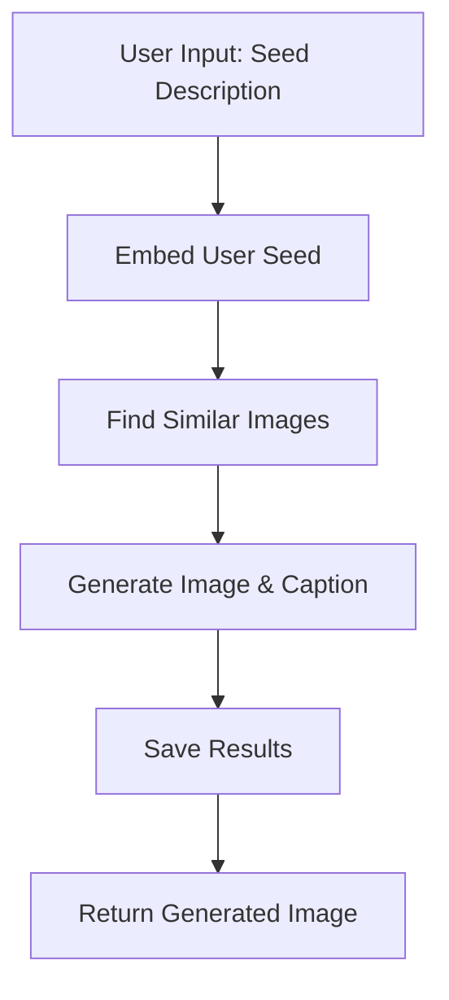

# MultiModel AI - Art Generation Platform

A comprehensive AI art generation platform using LangGraph workflows, Stable Diffusion, and vector search for creating high-quality artwork with intelligent captioning and style analysis.

## 🎨 Overview

This platform enables users to generate artistic images from text descriptions using a sophisticated LangGraph workflow that combines:
- **User-provided seed descriptions** for creative control
- **Vector similarity search** to find relevant reference images
- **GPT-4o powered caption generation** for rich descriptions
- **Stable Diffusion** for high-quality image generation
- **CLIP-based image analysis** for style understanding

## 🏗️ Architecture

### Core Components

```
┌─────────────────┐    ┌─────────────────┐    ┌─────────────────┐
│   Gradio UI     │    │  LangGraph      │    │  Vector DB      │
│   (Frontend)    │◄──►│  Workflow       │◄──►│  (Pinecone)     │
└─────────────────┘    └─────────────────┘    └─────────────────┘
                              │
                              ▼
┌─────────────────┐    ┌─────────────────┐    ┌─────────────────┐
│  GPT-4o        │    │  Stable         │    │  CLIP           │
│  Caption       │    │  Diffusion      │    │  Analysis       │
│  Generator     │    │  Service        │    │  Service        │
└─────────────────┘    └─────────────────┘    └─────────────────┘
```

## 🔄 User Seed Workflow (LangGraph Flow)

### Detailed Workflow Steps



#### 1. **Embed User Seed Node** (`embed_user_seed_node`)
- **Input**: User-provided text description
- **Process**: Uses CLIP text encoder to convert text to vector embedding
- **Output**: 512-dimensional embedding vector
- **Technology**: OpenAI CLIP model for text encoding

#### 2. **Find Similar Images Node** (`find_similar_images_node`)
- **Input**: Text embedding vector
- **Process**: 
  - Queries Pinecone vector database for similar images
  - Retrieves top 5 most similar images with metadata
  - Extracts rich metadata (descriptions, objects, people, settings, composition)
- **Output**: List of similar image objects with metadata
- **Technology**: Pinecone vector database with cosine similarity

#### 3. **Generate Image & Caption Node** (`generate_image_and_caption_node`)
- **Input**: User seed + similar image metadata
- **Process**:
  - **Image Generation**: Uses GPT-4o to create optimized SDXL prompts
  - **Parallel Processing**: Generates image and caption simultaneously
  - **Style Analysis**: Determines dominant art category from similar images
  - **Context Enhancement**: Combines user seed with similar image metadata
- **Output**: Generated image + AI-generated caption
- **Technology**: 
  - Stable Diffusion v1.5 for image generation
  - GPT-4o for prompt optimization and caption generation

#### 4. **Save Results Node** (`save_results_node`)
- **Input**: Generated image and caption
- **Process**:
  - Saves image to `generated_images/` directory
  - Saves caption metadata to `generated_captions/` directory
  - Logs workflow statistics and metadata
- **Output**: File paths and metadata

## 🤖 Models & Technologies

### Core Models

#### **1. Stable Diffusion v1.5**
- **Purpose**: High-quality image generation
- **Model**: `runwayml/stable-diffusion-v1-5`
- **Features**:
  - DPM++ 2M scheduler for faster inference
  - Memory-efficient attention slicing
  - Support for MPS (Apple Silicon) and CPU
  - Deterministic generation with seed control

#### **2. GPT-4o (OpenAI)**
- **Purpose**: Caption generation and prompt optimization
- **Capabilities**:
  - Rich, contextual caption generation
  - SDXL prompt optimization
  - Style-aware descriptions
  - Multi-language support

#### **3. CLIP (OpenAI)**
- **Purpose**: Text and image understanding
- **Model**: `openai/clip-vit-base-patch32`
- **Features**:
  - Text-to-vector encoding
  - Image-to-vector encoding
  - Cross-modal similarity search
  - Zero-shot classification

#### **4. BLIP-2 (Optional)**
- **Purpose**: Image captioning for training data
- **Model**: `Salesforce/blip2-opt-2.7b`
- **Features**: Detailed image descriptions for dataset preparation

### Preprocessing Logic

#### **Data Pipeline**
```
Raw Images → CLIP Analysis → Metadata Extraction → Vector Embedding → Pinecone Storage
```

#### **Metadata Extraction**
- **Image Analysis**: CLIP analyzes images for objects, people, settings
- **Style Classification**: Automatic art category detection
- **Composition Analysis**: Color schemes, layout patterns
- **Content Description**: Detailed textual descriptions

#### **Vector Database Schema**
```json
{
  "id": "unique_image_id",
  "embedding": [0.1, 0.2, ...], // 512-dim CLIP embedding
  "metadata": {
    "image_name": "artwork_001.jpg",
    "category": "painting",
    "description": "Detailed description...",
    "objects": "mountain, lake, trees",
    "people_characters": "none",
    "setting_location": "landscape, outdoors",
    "composition_colors": "blue, green, earth tones"
  }
}
```

## 🚀 Scaling Strategy (1 Lakh+ Images)

### Microservices Architecture

#### **1. Stable Diffusion Service**
```python
# Deploy as separate containerized service
class StableDiffusionService:
    - Load model once, serve multiple requests
    - GPU optimization for batch processing
    - Auto-scaling based on queue length
    - Redis queue for job management
```

**Deployment Strategy:**
- **Container**: Docker with GPU support
- **Orchestration**: Kubernetes with GPU nodes
- **Scaling**: Horizontal scaling with load balancer
- **Queue**: Redis for job queuing and management

#### **2. CLIP Analysis Service**
```python
# Dedicated service for image analysis
class CLIPAnalysisService:
    - Batch processing for multiple images
    - Async processing with webhooks
    - Caching for repeated analysis
    - REST API for integration
```

**Deployment Strategy:**
- **Container**: Lightweight Docker container
- **Scaling**: Auto-scaling based on analysis queue
- **Storage**: Temporary storage for processing
- **API**: RESTful API for easy integration

#### **3. GPT-4o Caption Service**
```python
# OpenAI API wrapper service
class CaptionGenerationService:
    - Rate limiting and retry logic
    - Batch processing for efficiency
    - Caching for similar prompts
    - Cost optimization strategies
```

### Data Storage Strategy

#### **S3 Integration**
```python
# Training data storage in S3
s3_structure = {
    "training-data/": {
        "drawing/": "*.jpg",
        "painting/": "*.jpg", 
        "sculpture/": "*.jpg",
        "engraving/": "*.jpg",
        "iconography/": "*.jpg"
    },
    "generated-images/": "user_generated_*.png",
    "metadata/": "*.jsonl"
}
```

**Benefits:**
- **Scalability**: Unlimited storage capacity
- **Cost**: Pay-per-use storage model
- **Reliability**: 99.99% availability
- **Security**: Encrypted at rest and in transit

#### **Pinecone Vector Database**
```python
# Vector database configuration
pinecone_config = {
    "index_name": "artwork_embeddings",
    "dimension": 512,  # CLIP embedding dimension
    "metric": "cosine",
    "pod_type": "p1.x1",  # For production scale
    "replicas": 3  # High availability
}
```

**Scaling Features:**
- **Auto-scaling**: Handles 1M+ vectors
- **Real-time search**: Sub-second query times
- **Metadata filtering**: Efficient category-based search
- **Hybrid search**: Vector + metadata queries

### Performance Optimization

#### **1. Batch Processing**
```python
# Process multiple images in batches
def process_batch(images: List[str], batch_size: int = 32):
    for batch in chunk(images, batch_size):
        embeddings = clip_service.encode_batch(batch)
        pinecone_service.upsert_batch(embeddings)
```

#### **2. Caching Strategy**
```python
# Multi-level caching
cache_layers = {
    "L1": "Redis (frequent queries)",
    "L2": "Memory cache (session data)", 
    "L3": "S3 (generated images)"
}
```

#### **3. Load Balancing**
```python
# Service load balancing
load_balancer = {
    "stable_diffusion": "Round-robin across GPU nodes",
    "clip_analysis": "Least connections",
    "caption_generation": "Weighted by API limits"
}
```

### Monitoring & Analytics

#### **Key Metrics**
- **Throughput**: Images generated per hour
- **Latency**: End-to-end generation time
- **Quality**: User satisfaction scores
- **Cost**: API usage and storage costs

#### **Alerting**
```python
# Critical alerts
alerts = {
    "high_latency": ">30s generation time",
    "queue_backlog": ">1000 pending jobs", 
    "api_errors": ">5% error rate",
    "storage_full": ">80% S3 usage"
}
```

## 🛠️ Installation & Setup

### Prerequisites
- Python 3.13+
- Docker & Docker Compose
- AWS CLI (for S3 integration)
- Pinecone API key
- OpenAI API key

### Quick Start

```bash
# 1. Clone repository
git clone <repository-url>
cd MultiModel_AI

# 2. Create virtual environment
python -m venv multimodal_ai_venv
source multimodal_ai_venv/bin/activate

# 3. Install dependencies
pip install -r requirements.txt

# 4. Set environment variables
export OPENAI_API_KEY="your_openai_key"
export PINECONE_API_KEY="your_pinecone_key"
export AWS_ACCESS_KEY_ID="your_aws_key"
export AWS_SECRET_ACCESS_KEY="your_aws_secret"

# 5. Run the application
python run_gradio_app.py
```

### Environment Variables
```bash
# Required environment variables
OPENAI_API_KEY=sk-...
PINECONE_API_KEY=...
PINECONE_ENVIRONMENT=...
AWS_ACCESS_KEY_ID=...
AWS_SECRET_ACCESS_KEY=...
AWS_DEFAULT_REGION=us-east-1
```

## 📊 Usage Examples

### Basic Image Generation
```python
from src.main.generation.user_seed_workflow import run_user_workflow

# Generate image from user description
result = run_user_workflow("a majestic dragon soaring over a medieval castle at sunset")
print(f"Generated image: {result['output_path']}")
print(f"Caption: {result['generated_caption']}")
```

### Style-Specific Generation
```python
from src.main.generation.image_generator import StableDiffusionGenerator

generator = StableDiffusionGenerator()
image = generator.generate_image_with_style(
    base_prompt="a serene landscape",
    art_category="painting",
    num_inference_steps=25,
    guidance_scale=7.5
)
```

## 🔧 Development

### Project Structure
```
MultiModel_AI/
├── src/main/
│   ├── generation/          # Image generation workflows
│   ├── preprocessing/       # Data preprocessing utilities
│   ├── db/                 # Vector database operations
│   ├── config/             # Configuration management
│   └── utils/              # Utility functions
├── generated_images/        # Output images
├── generated_captions/      # Generated captions
├── configs/                # Training configurations
└── requirements.txt         # Dependencies
```

### Adding New Features
1. **New Art Categories**: Update `ArtCategory` enum in `models.py`
2. **Custom Prompts**: Modify `get_art_style_prompt()` in `image_generator.py`
3. **Additional Models**: Extend workflow nodes in `user_seed_workflow.py`

## 📈 Future Roadmap

### Phase 1: Core Platform (Current)
- ✅ User seed workflow
- ✅ Basic image generation
- ✅ Vector similarity search
- ✅ Caption generation

### Phase 2: Scaling (Next)
- 🔄 Microservices deployment
- 🔄 S3 integration
- 🔄 Batch processing
- 🔄 Performance optimization

### Phase 3: Advanced Features
- 📋 Custom model fine-tuning
- 📋 Multi-modal generation
- 📋 Real-time collaboration
- 📋 Advanced analytics

## 🤝 Contributing

1. Fork the repository
2. Create a feature branch
3. Make your changes
4. Add tests
5. Submit a pull request

## 📄 License

This project is licensed under the MIT License - see the LICENSE file for details.

## 🆘 Support

For support and questions:
- Create an issue on GitHub
- Check the documentation in `/docs`
- Review the example notebooks

---

**Built with ❤️ using LangGraph, Stable Diffusion, and OpenAI technologies** 